## Topics today

- How computers work
- Running Quarto
- Writing in Quarto
- Publishing to GitHub pages

# How Computers Work

(for the casual user)

## How files work: generalities

- Programs store files as strings of binaries (0 & 1).
- Programs have their own conventions & formats to read & write files into binary.
  - The "file extension" is a part of a file name for programs to quickly know the file format.
  - Your OS (Windows, macOS) helps make this association easier by double click to open with default programs.
  - But file extension is just part of a file name: <mark>you can change or omit it</mark>.

## How files work: text files

- A common format is plain text for human-readability.
  - Notepad in Windows, TextEdit in macOS, etc. read plain text files, by convention `.txt`.
  - Markdown (.md), HTML (.ht**ml**), etc. are enhanced text files.
  - Markdown syntax draws from texting/email conventions. See [Wikipedia](https://en.wikipedia.org/wiki/Markdown#Examples).

## How files work: notebooks

- Extended comments in code is harder to read.
- This led to popularity of **computational notebooks**:
  - Markdown for text explanations
  - Code snippets for code/simulation/data exploration.
- **iPython** did this for Python and stored its files as `.ipynb`
- iPython changed name to **Jupyter** to reflect their support of **Ju**lia, **Pyt**hon, and **R**, but kept the extension name `.ipynb`.
- Google Colab implements Jupyter notebook in the cloud.

## How files work: Quarto

- The Quarto program makes publishing notebooks in presentable formats easier.
- It uses its own enhanced Markdown and stores files as `.qmd`.
  - Global document metadata is stored at the top as YAML.
  - Markdown blocks are as usual.
  - Code blocks use three backticks as in `.md`

# Running Quarto

## Running Quarto

- **In RStudio:**
  - Create or open `.qmd` file
  - Press "Render" button to see results
- **In VSCode:**
  - Create or open `.qmd` file, say "example.qmd"
  - In terminal run `quarto preview example.qmd` for live-preview; `ctrl+C` or `cmd+C` kills this process.
  - In terminal run `quarto render example.qmd` to create output files.

# Writing in Quarto

## Code blocks: type this

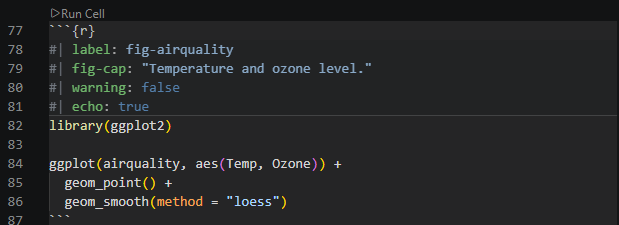


## Code blocks: get this


```{r}
#| label: fig-airquality
#| fig-cap: "Temperature and ozone level."
#| warning: false
#| echo: true
library(ggplot2)

ggplot(airquality, aes(Temp, Ozone)) + 
  geom_point() + 
  geom_smooth(method = "loess")
```

## Code blocks: some code chunk options

- `echo: false` hides code completely
- `code-fold: true` folds code instead
- `output: false` to not display computation output
- `label:` is for cross-referencing/hyperlink
- `fig-cap:` is figure caption
- `fig-alt` is alternative text for screen readers to read description of image

[Quarto computations reference](https://quarto.org/docs/computations/r.html)

## Metadata (YAML)

Sits at the top of your Quarto document and sets global document properties:

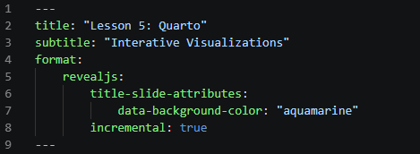

## Output formats

- `format: html` for single webpage
- `format: dashboard` for data dashboard
- `format: revealjs` for slides on the web
- `format: pdf` for printed documents
- etc.
- For website (collection of webpages), see [Quarto guide](https://quarto.org/docs/websites/).

## Output formats: html

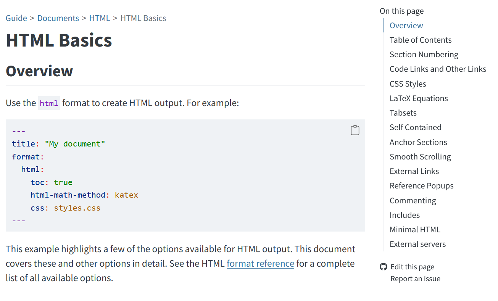

## Output formats: dashboard

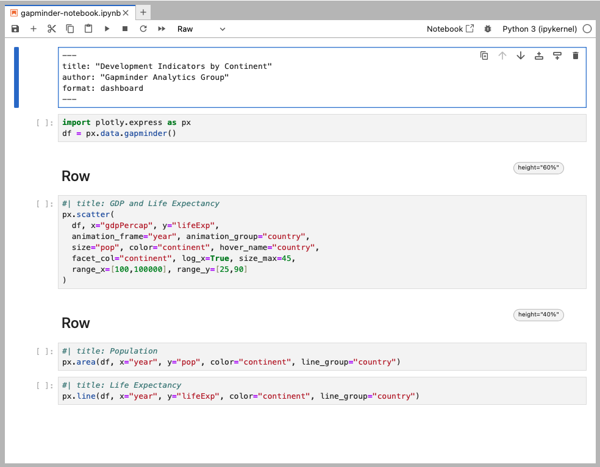

## Output formats: dashboard


## Output formats: dashboard


## Output formats guide

Go to [Quarto's guide webpage](https://quarto.org/docs/guide/):

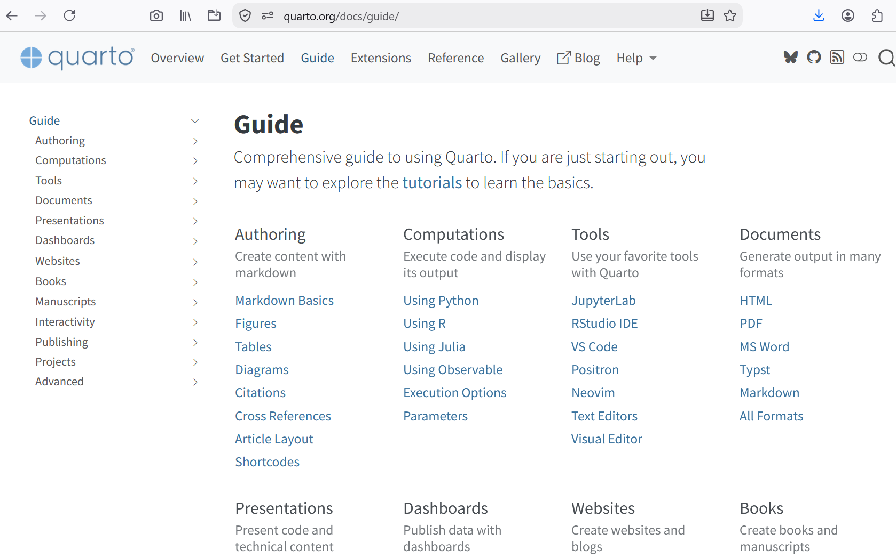

## Markdown

See [documentation](https://quarto.org/docs/authoring/markdown-basics.html).

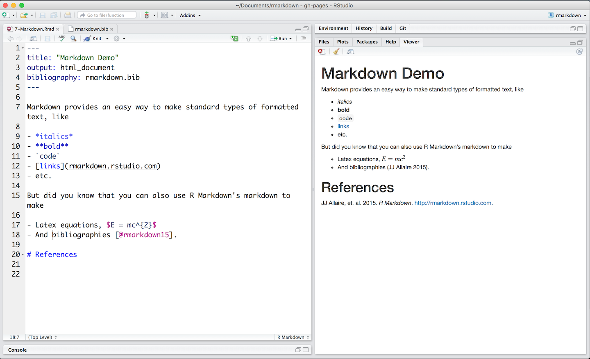

## Quarto Markdown: div

"Div fencing" `:::` wraps section in HTML divs. You can add custom or Quarto built-in classes to these divs:

```
::: {.border}
This content can be styled with a border
:::
```

## Quarto Markdown: span

Use square brackets around selection to add HTML spans:

`[This is some text]{.warning}` 

## Quarto Markdown: reference

[https://quarto.org/docs/authoring/markdown-basics.html#sec-divs-and-spans](https://quarto.org/docs/authoring/markdown-basics.html#sec-divs-and-spans)


# Publishing to GitHub Pages

## 1. Create GitHub account

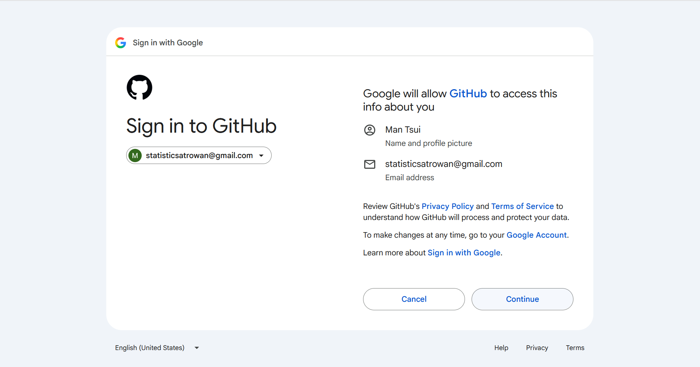

## 1. Create GitHub account

Choose a username **appropriate** to employers since your free website will be at `yourusername.github.io`:

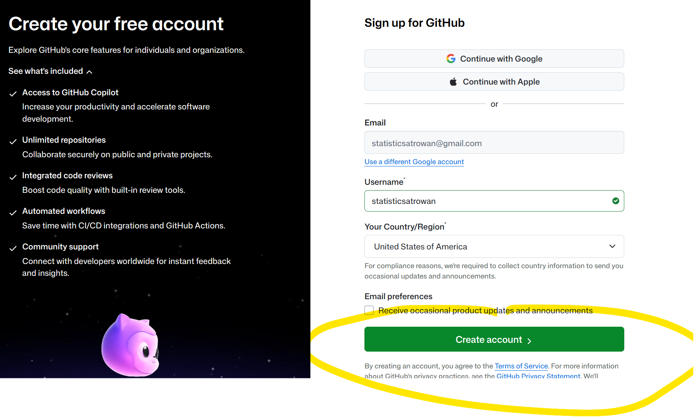

## 2. Create GitHub repo

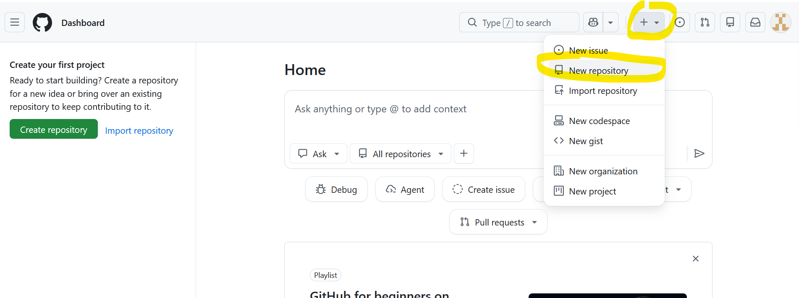

## 2. Create GitHub repo

The free website's repo name must be `yourusername.github.io`

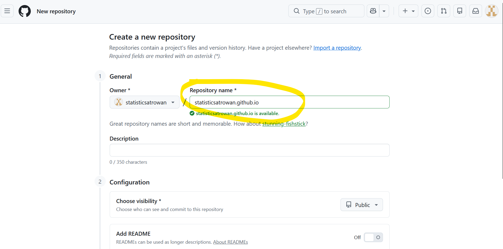

## 2. Create GitHub repo

Turn on "Add README" and hit "Create repository":

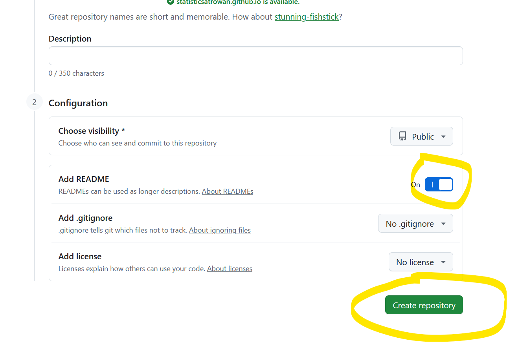

## 2. Create GitHub repo

What you should see now:

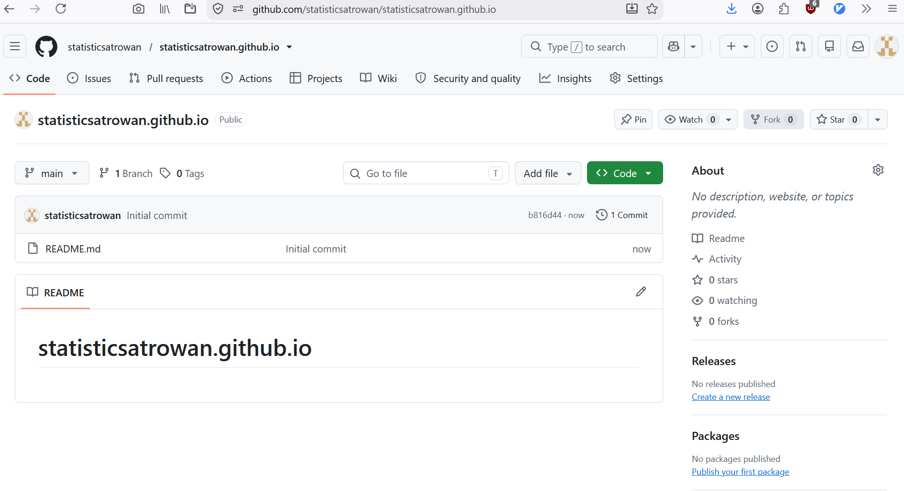

## 3. See your free website

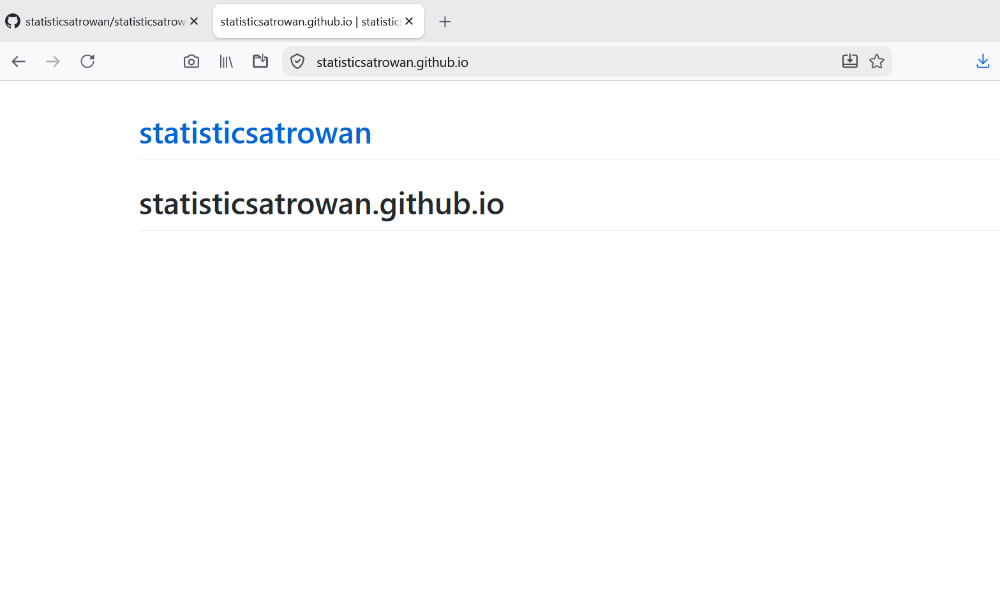

This is just the README.md which you can modify.

## 3. See your free website


Your website's homepage would look even better if you upload a nice webpage named `index.html`.

## 4. Upload your project

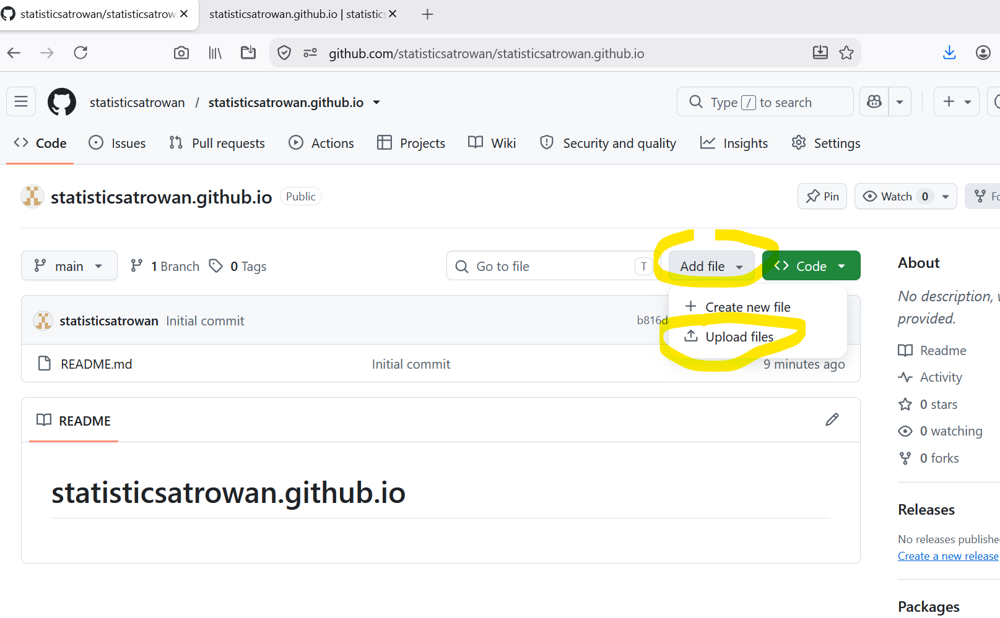

## 4. But wait: Quarto render the HTML

- In your Quarto file YAML, include<br>
```
format: 
    html:
        output-file: "index.html"
```

- Why? `index.html` ensures a [clean URL](https://en.wikipedia.org/wiki/Clean_URL): a server pointed at a folder automatically reads the `index.html` of that folder. So your html file adopts your folder's name.

- Now render your `.qmd` in RStudio with "Render" button or in VSCode with `quarto render yourfile.qmd` in terminal.

## 4. Upload your project

Take your project folder including the `_files` folder which contains external dependencies (CSS, JS, etc.) to upload to GitHub:

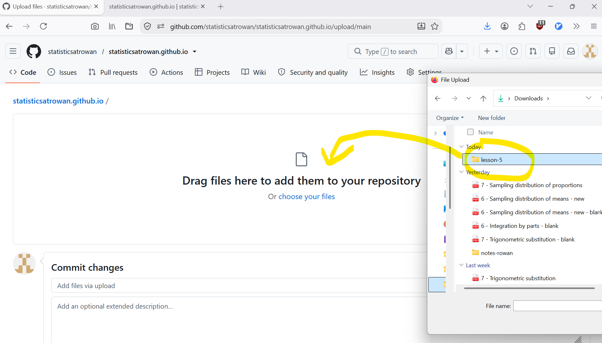

## 5. See your Quarto webpage

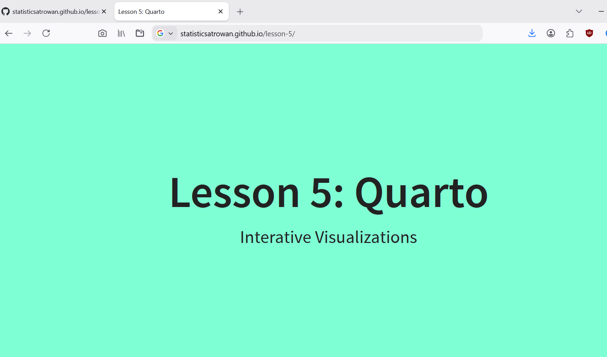

## What else?

On your free GitHub page: do not put secrets (confidential database, passwords, etc.)

Push to GitHub faster? Use **GitHub Desktop**. See [YouTube tutorial](https://www.youtube.com/watch?v=M_x2r36WC4s).

